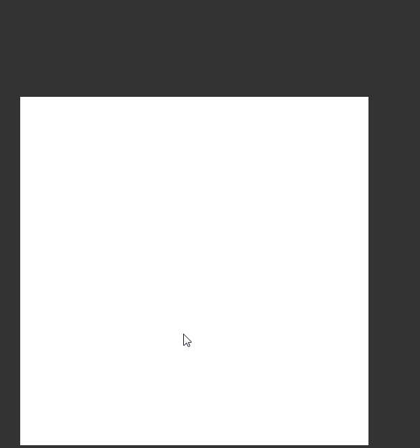

<h1 align="center">
   
  Artificial neural network
   
</h1>

<h4 align="center">Simple artificial neural network, with using the <a href="https://github.com/BrainJS/brain.js" target="https://github.com/BrainJS/brain.js">brain.js</a></h4> library.  :heart:

## Instructions

* Draw the image, then click V to add it in to neural network, then C to clean the canvas. Add 3-5 positive and negative pictures. Then draw the image and for analyse and click B.

